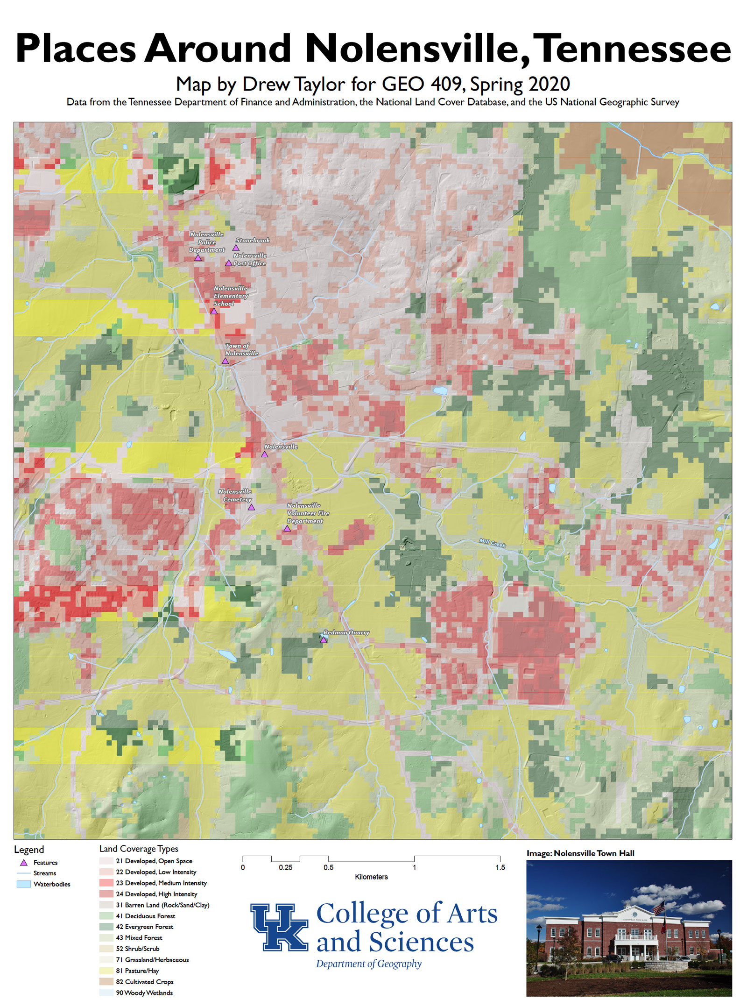

# Nolensville

## Base map GeoPDF

[Nolensville, TN Trail System](basemap/Nolensville.pdf)

    
*Preview of map*

## Photographs of area

    
*Mill Creek*, photo by Drew Taylor

    
*Floodplain*, photo by Drew Taylor

     
*Retention Pond*, photo by Drew Taylor

## Red River Gorge GeoPDF

I also made a basemap of the Red River Gorge, but couldn't take pictures of it. Additionally, ArcGIS was weird and kept leaving the hillshade out of the layout; I messaged you on Canvas about the problem but dropped it because I was focusing on Nolensville.

[Red River Gorge Basemap](basemap/Layout.pdf)
